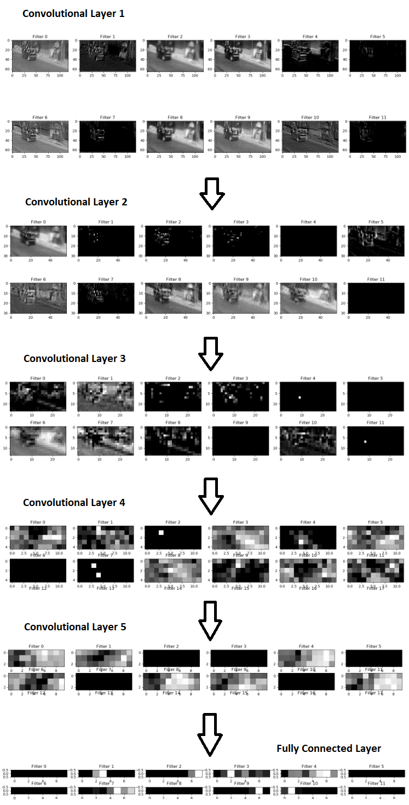

# Self-Driving-Car-on-Indian-Roads
Computer Vision Guided Deep Learning Network &amp; Machine Learning Techniques to build Fully-Functional Autonomous Vehicles

  

More Details of the Project here:
https://medium.com/@AnandAI/self-driving-car-on-indian-roads-4e305cb04198


# How to Use?

## Data Source/ Generate Training Data:

First of all, record a driving video or obtain driving video from any source. I have contributed the indian driving dataset along with parameters in Kaggle. You can download it from here and unzip to project folder root.

https://www.kaggle.com/ananduthaman/self-driving-car-on-indian-roads

If you are recording your own driving video, then generate the training parameters, i.e. steering angle, acceleration, brake and gear using the console interface. This is a hack to generate training data, without tampering with the OBD interface of the car, which is a lot harder.

## To invoke Console Interface:
```
python create_train_data.py
```
The interface program writes the steering angle, acceleration, brake and gear values to an output file, for every frame in the video. If the video is recorded at 30 fps then the parameter values have to be written every 1000/30 = 33 ms, in a loop. To get this accuracy is a bit challenging, as it depends on the execution time of the 'while' loop, that writes the output. You may have to write every 30–33 ms to properly sync with the video, recorded at 30 fps. Consider the 'Write Frequency' as a hyper-parameter, since it depends on the machine speed. You can tune write frequency by doing 1-minute driving simulation and check how far off it is from 60x30 = 1800 frames.

## Data Pre-Processing
The self-recorded driving videos required some pre-processing steps before it could be fed to the network. Following softwares were used, in sequence:
- Lossless Cut - To cut out relevant video without loss.
- Anytime Video Converter - To resize video to reduce data.
- Video to JPG Converter - To extract frames from video.

## Generate Optical Flow:

The optical flow of the video need to be generated before training.
```
python gen_optical_flow_traindata.py
```


## Training the Data
Three driving control parameters viz. Steering Angle, Acceleration and Brake, are trained with different models and are concurrently executed at run time to drive the car.

The model files would be generated inside '/save' directory.
```
python train_accel.py
python train_brake.py
python train_steer.py
```
The visualization of CNN layers for model interpretability is done in train_accel.py.


The prototyping for models can be done using:
```
ipython notebook CNN_Accel_Brake.ipynb
```

## To run the system:
The models for steering, acceleration, brake and gear are simultaneously executed in different sessions with corresponding computation graphs, to predict all driving control values for each frame.
```
python run_dataset.py
```
## To run the system on new track:
```
python run_dataset_Test.py
```

If you have any query or suggestion, you can reach me here.
https://www.linkedin.com/in/ananduthaman/
